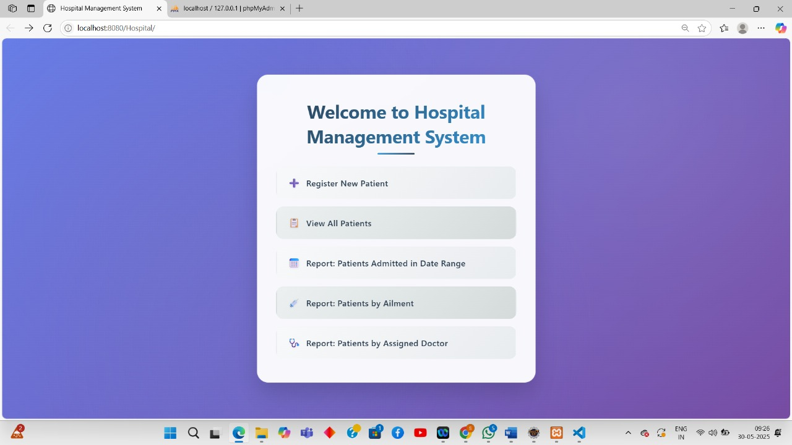
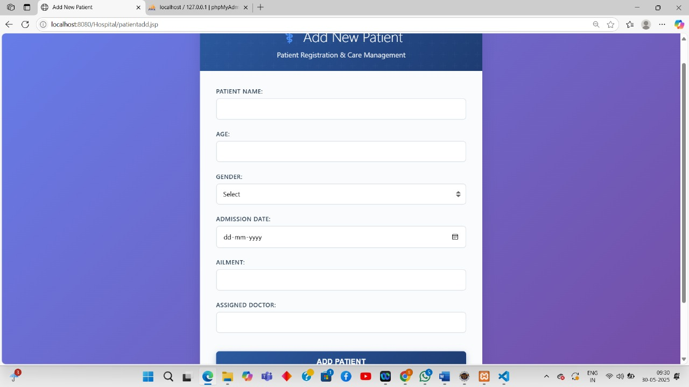
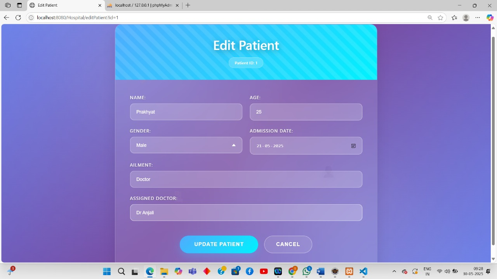
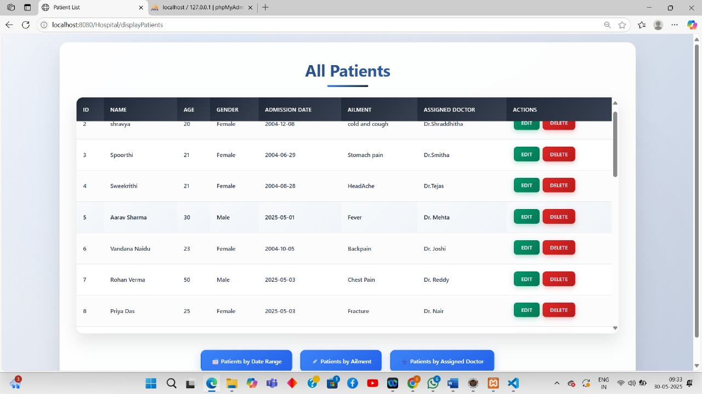
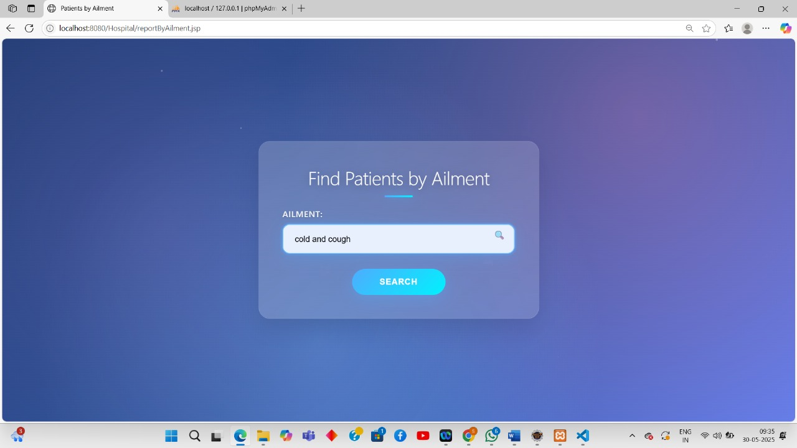
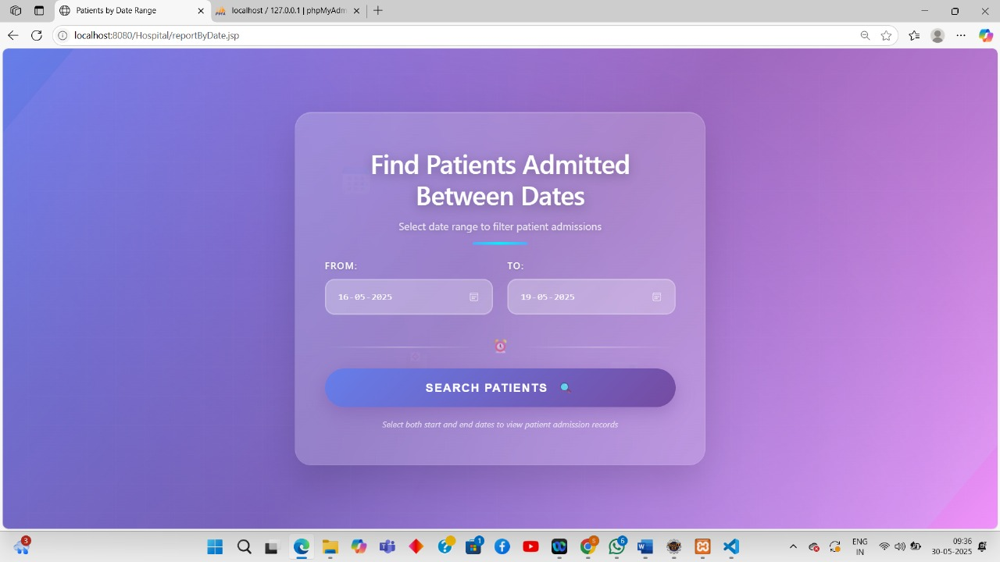
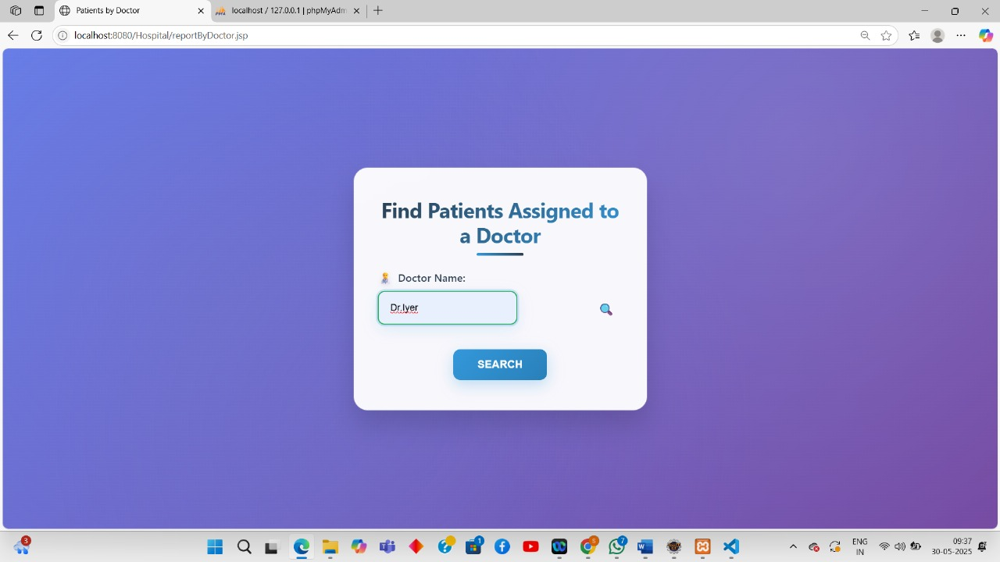

# 🏥 Hospital Management System

A web-based Java application to manage hospital records using **JSP**, **Servlets**, **JDBC**, and **MySQL**, following the **MVC architecture**.

---

## 🚀 Features

- Add new patient information  
- Update existing patient records  
- Delete patient records  
- Display all patient details  
- Generate reports:
  - Patients admitted within a date range  
  - Patients with specific ailments  
  - Patients assigned to a specific doctor  

---

## 📁 Project Structure

```
HospitalWebApp/
├── WebContent/
│   ├── index.jsp
│   ├── patientadd.jsp
│   ├── patientupdate.jsp
│   ├── patientdelete.jsp
│   ├── patientdisplay.jsp
│   ├── reports.jsp
│   ├── report_form.jsp
│   └── report_result.jsp
├── src/
│   ├── com/
│   ├── dao/
│   │   └── HospitalDAO.java
│   ├── model/
│   │   └── Patient.java
│   └── servlet/
│       ├── AddPatientServlet.java
│       ├── UpdatePatientServlet.java
│       ├── DeletePatientServlet.java
│       ├── DisplayPatientsServlet.java
│       ├── ReportServlet.java
│       └── ReportCriteriaServlet.java
└── WEB-INF/
    └── web.xml
```

---

## 🗄 Database Setup

### 1. Create Database

```sql
CREATE DATABASE IF NOT EXISTS hospital_management;
USE hospital_management;
```

### 2. Create Table

```sql
CREATE TABLE Patients (
    PatientID INT PRIMARY KEY,
    PatientName VARCHAR(100),
    Age INT,
    Gender VARCHAR(10),
    AdmissionDate DATE,
    Ailment VARCHAR(255),
    AssignedDoctor VARCHAR(100)
);
```

### 3. Insert Sample Data

```sql
INSERT INTO Patients VALUES 
(1, 'John Doe', 45, 'Male', '2024-12-01', 'Diabetes', 'Dr. Smith'),
(2, 'Jane Smith', 30, 'Female', '2025-01-15', 'Asthma', 'Dr. Adams'),
(3, 'Ravi Kumar', 25, 'Male', '2025-03-10', 'Fracture', 'Dr. Mehta'),
(4, 'Meera Nair', 50, 'Female', '2025-04-22', 'Hypertension', 'Dr. Roy');
```

---

## ⚙ Installation & Setup

### Step 1: Clone/Download the Project

Download all the files and organize them using the structure shown above.

### Step 2: Database Configuration

1. Start MySQL Server  
2. Run the above SQL scripts to create the database and tables  
3. Update database credentials in `HospitalDAO.java`:

```java
connection = DriverManager.getConnection(
    "jdbc:mysql://localhost:3306/hospital_management", 
    "your_username", 
    "your_password");
```

### Step 3: Add MySQL JDBC Driver

- Download the MySQL Connector/J from [MySQL official site](https://dev.mysql.com/downloads/connector/j/)  
- Add the `.jar` file to `WEB-INF/lib`  
- Also add it to your IDE's *Build Path* if needed  

### Step 4: Deploy to Tomcat

- Create a *Dynamic Web Project* in your IDE (like Eclipse)  
- Copy the source and web content files  
- Deploy the project to the Tomcat server  
- Start the server  

### Step 5: Access the Application

Go to your browser and open:

```
http://localhost:8080/Hospital_Management_System/
```

---

## 🖼 Output Screenshots *(Replace with your actual screenshots)*

### 🏠 Home Page


### ➕ Add Patient


### 📝 Update Patient


### ❌ Delete Patient


### 📋 Display Patients


### 📊 Generate Reports
  
  

